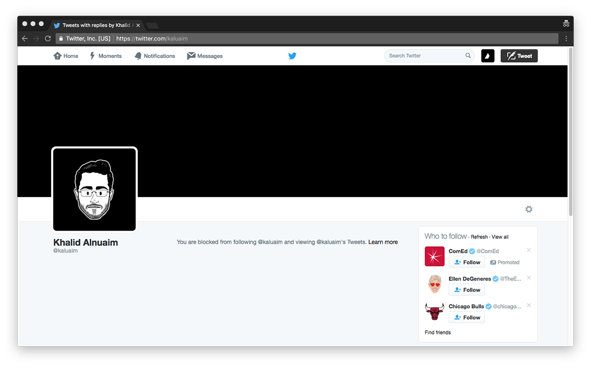
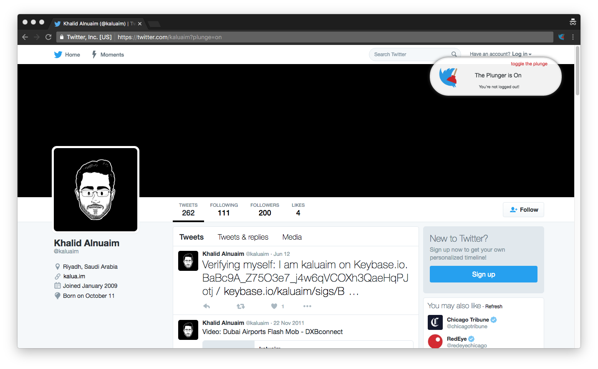

Twitter Plunger
###############

Bypass blocked Twitter accounts (Unblocker, NOT really!)

How it's work
=============

The idea is to present the publicly available page for accounts you're blocked from following. By intercepting the request and removing the Cookie from the ``requestHeaders``.

Screenshot
===========
**Before**

**After**

Author
======

`@kaluaim <http://kalua.im/>`__

License
=======
Twitter Plunger is licensed under the MIT License.
